# Discover Pool P2 — Human Visual Review Package

**Date:** 2026-09-17 (Europe/Brussels)  
**For:** Koen (visual review only)  
**Path:** `VacationWebNext/media/contact-sheets/discover-pool-p2-review/`  
**Open:** `index.html` (gallery) or this `REVIEW_PACKAGE.md`

## Summary

| Metric | Count |
|---|---:|
| Total pending | 27 |
| WOW Discovery yes | 22 |
| New (AN-016 gap-fill) | 5 |
| Reclassified (Goloritzè) | 1 |
| OPEN gaps remaining | Samaria Gorge (Crete) |

**Rules:** Do not mark dual-verified / published here. Tick keep / reject / needs-reshoot mentally or annotate offline.

Open the HTML gallery for thumbnails: [`index.html`](index.html)

---

## Albania (8)

### nature-setting · ksamil-sunset

-   
  **`vw-story-albania-ksamil-sunset-33079364`** — Ksamil sunset beach — turquoise Ionian water  
  WOW yes · Pexels · truth=`unverified` · CHG-016

### establishing · dhermi-framed

-   
  **`vw-story-albania-dhermi-framed-33396275`** — Dhërmi beach framed by greenery — Riviera character  
  WOW yes · Pexels · truth=`unverified` · CHG-016

### nature-setting · blue-eye-spring

-   
  **`vw-story-albania-blue-eye-commons`** — Syri i Kaltër (Blue Eye) — karst spring wow discovery  
  WOW yes · Wikimedia Commons · truth=`unverified` · CHG-016

### establishing · ksamil-beach

-   
  **`vw-story-albania-ksamil-beach-commons-commons`** — Ksamil beach establishing — Riviera postcard  
  WOW no · Wikimedia Commons · truth=`unverified` · CHG-016

### waterfront-life · ksamil-beach-life

-   
  **`vw-story-albania-ksamil-beach-cc0-commons`** — Ksamil beach life / water  
  WOW no · Wikimedia Commons · truth=`unverified` · CHG-016

### establishing · himare-coast

-   
  **`vw-story-albania-himare-coast-commons`** — Himarë Riviera coast establishing  
  WOW no · Wikimedia Commons · truth=`unverified` · CHG-016

### settlement-character · gjirokaster-fortress

-   
  **`vw-story-albania-gjirokaster-fortress-20761909`** — Gjirokastër Fortress clock tower — castle character over stone city  
  WOW yes · Pexels · truth=`unverified` · NEW AN-016

### settlement-character · gjirokaster-slate-roofs

-   
  **`vw-story-albania-gjirokaster-slate-roofs-commons`** — Gjirokastër slate-stone roofs — UNESCO stone-city fabric  
  WOW yes · Wikimedia Commons · truth=`unverified` · NEW AN-016

## Sicily (6)

### settlement-character · cefalu-rocca

- 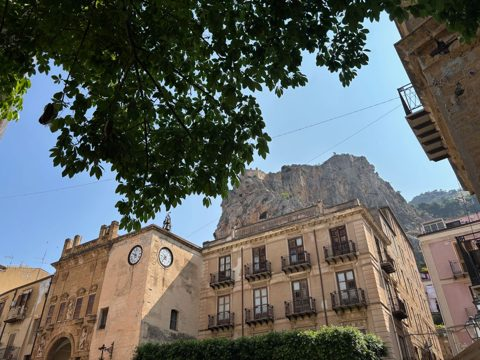  
  **`vw-story-sicily-cefalu-rocca-38193686`** — Cefalù historic fabric under La Rocca  
  WOW no · Pexels · truth=`unverified` · CHG-016

### establishing · cefalu-waterfront

- 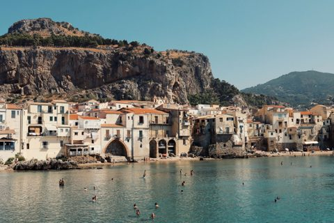  
  **`vw-story-sicily-cefalu-waterfront-18453312`** — Cefalù waterfront with mountain backdrop  
  WOW yes · Pexels · truth=`unverified` · CHG-016

### landmark · taormina-theatre

- 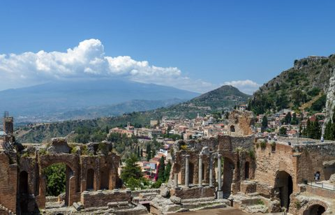  
  **`vw-story-sicily-taormina-theatre-4563289`** — Ancient Theatre of Taormina  
  WOW yes · Pexels · truth=`unverified` · CHG-016

### cultural-story · valle-templi

- 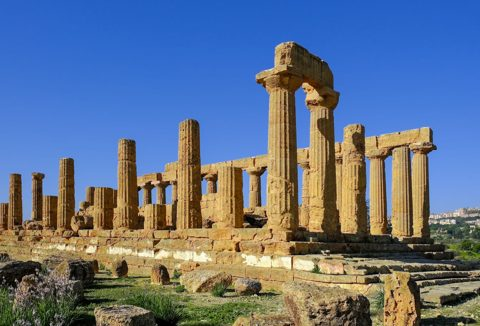  
  **`vw-story-sicily-valle-templi-10765309`** — Valley of the Temples Agrigento  
  WOW yes · Pexels · truth=`unverified` · CHG-016

### nature-setting · isola-bella

- 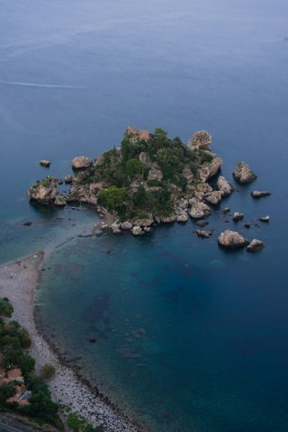  
  **`vw-story-sicily-isola-bella-37105275`** — Isola Bella aerial Taormina  
  WOW yes · Pexels · truth=`unverified` · CHG-016

### landmark · concordia-temple

- 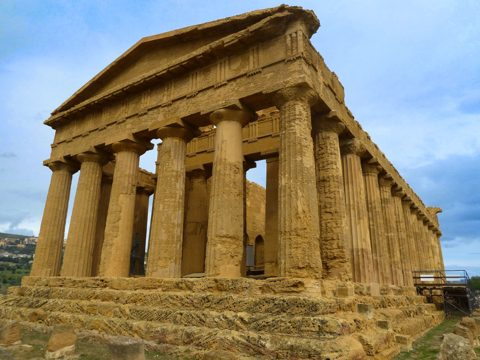  
  **`vw-story-sicily-concordia-temple-37261506`** — Ancient Greek temple Agrigento  
  WOW yes · Pexels · truth=`unverified` · CHG-016

## Crete (7)

### establishing · chania-port

- 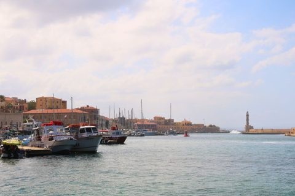  
  **`vw-story-crete-chania-port-30064009`** — Chania Venetian harbour  
  WOW yes · Pexels · truth=`unverified` · CHG-016

### landmark · chania-lighthouse

- 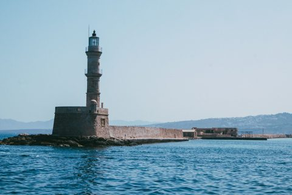  
  **`vw-story-crete-chania-lighthouse-13900806`** — Chania lighthouse from bay  
  WOW no · Pexels · truth=`unverified` · CHG-016

### nature-setting · balos-aerial

-   
  **`vw-story-crete-balos-aerial-37800644`** — Balos Lagoon aerial  
  WOW yes · Pexels · truth=`unverified` · CHG-016

### nature-setting · balos-beach

- 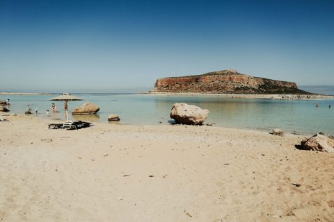  
  **`vw-story-crete-balos-beach-38169038`** — Balos Lagoon beach  
  WOW yes · Pexels · truth=`unverified` · CHG-016

### cultural-story · spinalonga

- 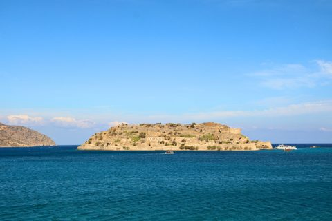  
  **`vw-story-crete-spinalonga-29962711`** — Spinalonga island  
  WOW yes · Pexels · truth=`unverified` · CHG-016

### nature-setting · elafonissi-water

- 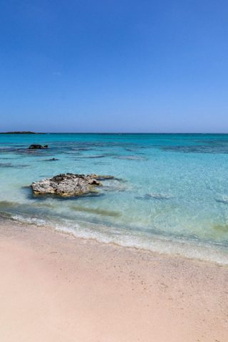  
  **`vw-story-crete-elafonissi-water-15071869`** — Elafonissi shallow turquoise + pink-tinged sand  
  WOW yes · Pexels · truth=`unverified` · NEW AN-016

### nature-setting · elafonissi-aerial

- 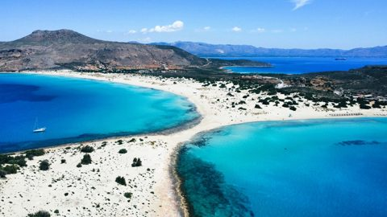  
  **`vw-story-crete-elafonissi-aerial-30002088`** — Elafonissi aerial sand-spit lagoon — iconic pink/white shallows  
  WOW yes · Pexels · truth=`unverified` · NEW AN-016

## Sardinia (6)

### establishing · emerald-coast

- 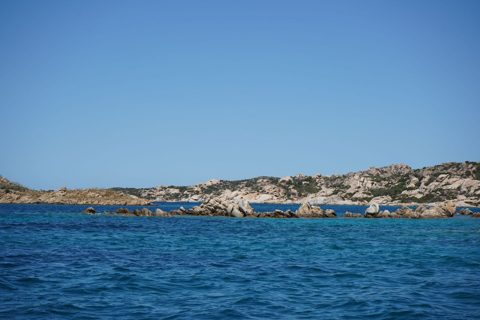  
  **`vw-story-sardinia-emerald-coast-38146980`** — Sardinia emerald coastal waters  
  WOW yes · Pexels · truth=`unverified` · CHG-016

### nature-setting · cala-goloritze

- 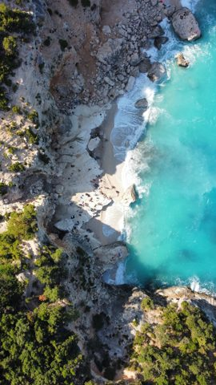  
  **`vw-story-sardinia-cliff-beach-aerial-23962079`** — Cala Goloritzé aerial — Baunei limestone cove (Aguglia coast)  
  WOW yes · Pexels · truth=`unverified` · RECLASSIFIED AN-016

### landmark · tavolara

- 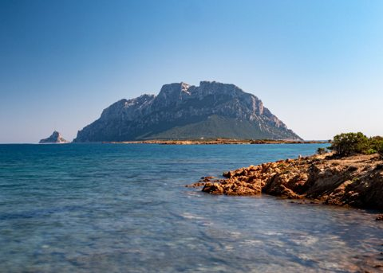  
  **`vw-story-sardinia-tavolara-18660972`** — Island of Tavolara  
  WOW yes · Pexels · truth=`unverified` · CHG-016

### nature-setting · piscinas

- 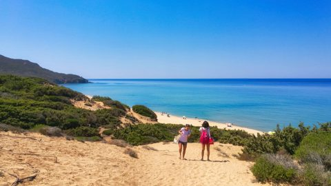  
  **`vw-story-sardinia-piscinas-36796797`** — Piscinas beach dunes  
  WOW yes · Pexels · truth=`unverified` · CHG-016

### nature-setting · porto-pino

- 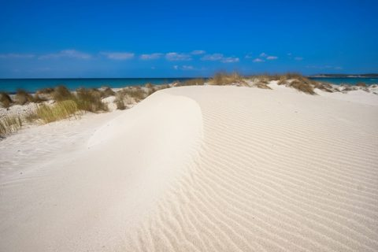  
  **`vw-story-sardinia-porto-pino-35142345`** — Porto Pino beach dunes  
  WOW yes · Pexels · truth=`unverified` · CHG-016

### cultural-story · nuraghe-su-nuraxi

- 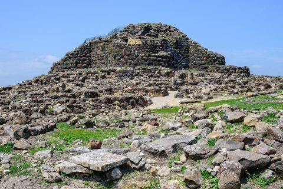  
  **`vw-story-sardinia-nuraghe-su-nuraxi-commons`** — Su Nuraxi Barumini — Bronze Age nuraghe tower landscape  
  WOW yes · Wikimedia Commons · truth=`unverified` · NEW AN-016

